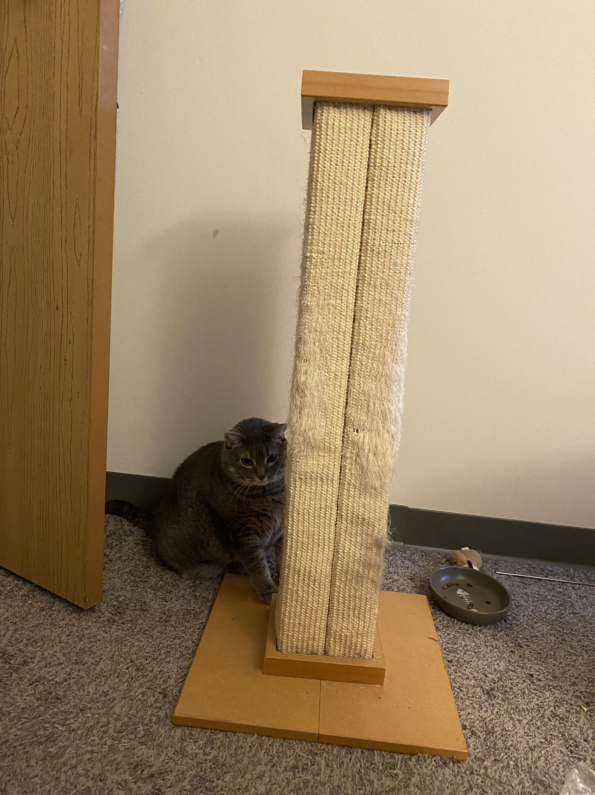
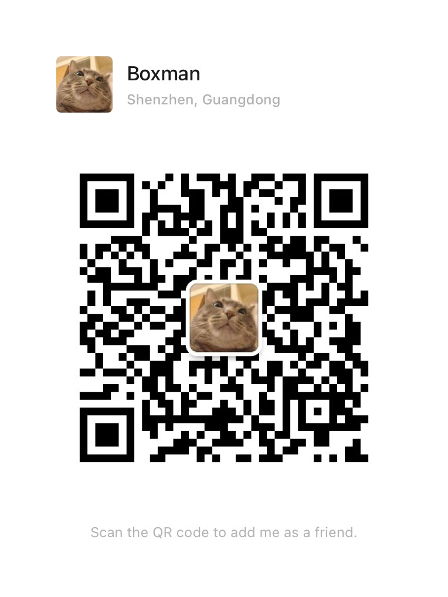

## 搬家出二手 (物品不定期更新)

### 出售物品详情

----------------------------------------------------------------
|物品编号 | 图片        | 描述           | 价格  | 状态 (在售 &check; or 已售 &cross;) |
| -------------| ------------- |:-------------:|:-----:| :---:|
|1|  | 加湿器 （小, 氛围灯, 适合办公桌上使用） |    $5 |&check;|
|2|  | 加湿器 （大 |    $15 |&check;|
|3|  | 全新A4纸 | $3 |&check;|
|4|  | 三明治机 (适合加工全（难）麦（吃）面包)| $5 |&check;|
|5|  | 咖啡机 [amazon link](https://www.amazon.com/dp/B07C1XC3GF?ref=emc_p_m_5_i_atc) 原价 ~$200 |   $30 |&check;|
|6|  | 落地灯 (可拆卸带原包装, 额外送两个替换灯泡) |   $15 |&check;|
|7|  | 高压锅 | $10 |&check;|
|8|  | 猫爬架 （需自提） |   $0 |&check;|
|9|  | 猫粮 （需自提） |   $0 |&check;|
|10|  | 猫砂 （需自提） |   $0 |&check;|

### 联系方式

***添加时备注收二手以及物品编号***

 

### 交付
小件物品可学校附近当面交付，大件需自取 (Seven Conners Apartment) 或者付费送上门
